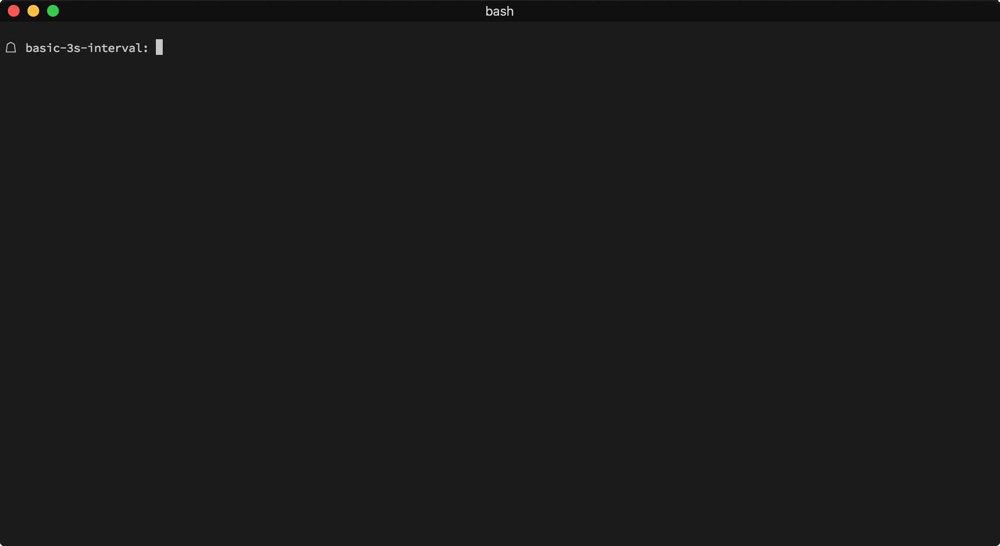

`tempo` [](https://goreportcard.com/report/github.com/ef2k/tempo) [](https://travis-ci.org/ef2k/tempo) [](https://godoc.org/github.com/ef2k/tempo)
=======
A dispatched batch queue to process items at time intervals or when a batching limit is met.

## Features
- **Non-blocking enqueue** <br> Queue up incoming items without blocking processing.

- **Dispatching by periodic time intervals** <br> Set a time interval and get batched items after time expires.

- **Dispatching as soon as a batch limit is met**<br> If a batch is filled before the time interval is up, dispatching is handled immediately.

- **Plain old Go channels** <br> Implementation relies heavily on channels and is free of mutexes and other bookkeeping techniques.



## Install
```sh
$ dep ensure -add github.com/ef2k/tempo
```

## Documentation
https://godoc.org/github.com/ef2k/tempo

## Sample Usage

Dispatch a batch at 10 second intervals or as soon as a batching limit of 50 items is met.
See `examples/` for working code.

```go
// initialize
d := tempo.NewDispatcher(&tempo.Config{
  Interval:      time.Duration(10) * time.Second,
  MaxBatchItems: 50,
})
defer d.Stop()
go d.Start()

// produce some messages
go func() {
  for i:= 0; i < 100; i++ {
    m := fmt.Sprintf("message #%d", i)
    d.Q<-m
  }
}()

// consume the batch
for {
  select {
    case batch := <-d.Batch:
      for _, b := range batch {
        s := b.(string)
        // do whatever.
        log.Print(s)
      }
  }
}
```

## Contribute
Improvements, fixes, and feedback are welcome.

## Legal
MIT license.
