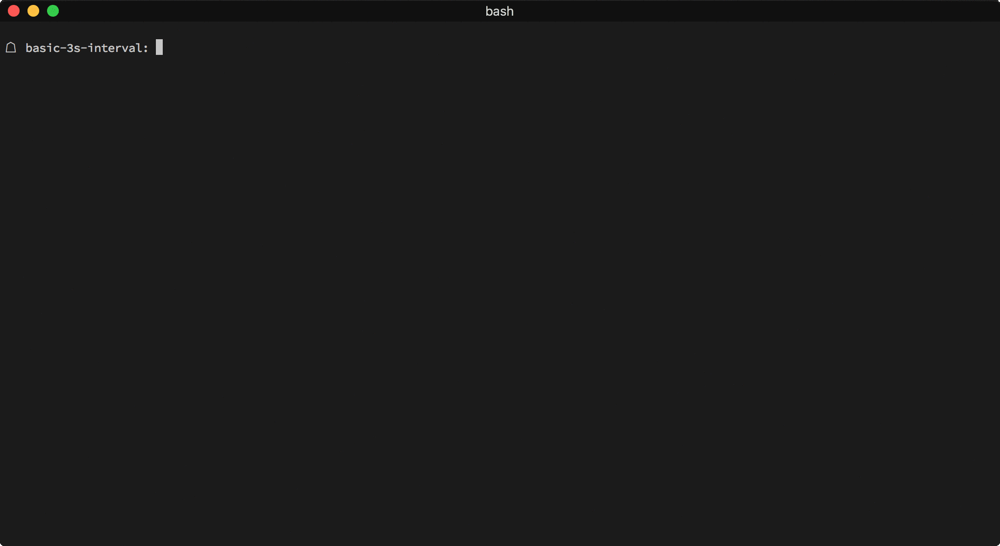

# tempo

[](https://pkg.go.dev/github.com/ef2k/tempo)
[](https://goreportcard.com/report/github.com/ef2k/tempo)


Tempo is an in-process event batcher for high-frequency workloads.

It collects events in memory and emits them in batches instead of processing
each one immediately. That matters when events arrive quickly and the real cost
is downstream: database writes, API calls, system calls, or any other fixed
per-event overhead.

Tempo is meant for the gap between "send everything one by one" and "bring in a
full messaging system." It gives you bounded buffering, timed flushes, and
batch shaping in a small local component.

In the current performance suite, a Raspberry Pi sustained about `242k
events/sec` during a 5-minute soak run with `~10KiB` payloads while delivering
all accepted items and staying within a small tuned memory budget. That does
not make the rest of a telemetry pipeline free, but it does show that the
queueing and batching layer itself is unlikely to be the bottleneck in many
real deployments.

If a single payload is larger than `MaxBatchBytes` but still fits within
`MaxBufferedBytes`, Tempo accepts it and flushes it as a one-item batch. Only
payloads that exceed `MaxBufferedBytes` are rejected.

Admission is based on both total fit and current free space:

- if a payload is larger than `MaxBufferedBytes`, it is rejected with
  `ErrPayloadTooLarge`
- if a payload would fit within `MaxBufferedBytes` in principle, but there is
  not enough pending space available right now, it is rejected with
  `ErrQueueFull`

Use it for:
- analytics and telemetry ingestion
- external API batching
- agent and LLM event collection



## Install
```sh
go get github.com/ef2k/tempo
```

## Documentation
[pkg.go.dev/github.com/ef2k/tempo](https://pkg.go.dev/github.com/ef2k/tempo)

## Configuration

```go
d, err := tempo.NewDispatcher(&tempo.Config{
    Interval:         30 * time.Second,
    MaxBatchBytes:    10 * tempo.MiB,
    MaxBufferedBytes: 500 * tempo.MiB,
})
```

This means:

- flush whatever is buffered every 30 seconds
- prefer batches up to 10 MiB
- never let Tempo own more than 500 MiB of payload data

If you do not need batch-size shaping, you can leave `MaxBatchBytes` unset and
let Tempo flush by `Interval` while `MaxBufferedBytes` remains the hard safety
boundary.


## Sample Usage

See `examples/` for working code.

## Contribute

Improvements, fixes, and feedback are welcome.
